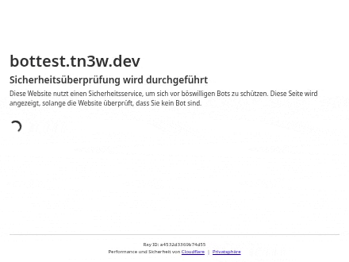

<div align="center">

<p>
  <picture>
    <source media="(prefers-color-scheme: dark)" srcset="assets/non-interactive-dark.gif">
    
  </picture>
  <picture>
    <source media="(prefers-color-scheme: dark)" srcset="assets/interactive-dark.gif">
    
  </picture>
</p>

# cloudflare-skip

**Skip Cloudflare challenges: solve once in a real browser, then reuse the clearance
with fast HTTP requests.**

[](https://pypi.org/project/cloudflare-skip)
[](https://pypi.org/project/cloudflare-skip)
[](LICENSE)

</div>

## Quick start

```bash
pip install cloudflare-skip
cloudflare-skip https://example.com
```

```python
from cloudflare_skip import get

response = get("https://example.com")
print(response.status_code, response.text)
```

`get` returns a `curl_cffi` response. Needs Chrome or Chromium and a display
(headful; headless gets flagged).

## How it works

1. Request with `curl_cffi` (Chrome TLS fingerprint) and the cached clearance.
2. `cf-mitigated: challenge` → a real browser (`nodriver`) opens the page.
3. Interactive Turnstile: after 2.8s `Tab` focuses the checkbox, `Space` ticks it.
4. Once `cf_clearance` exists and the challenge page is gone, cookies + user agent are
   cached per host in `~/.cache/cloudflare_skip.json` and replayed over HTTP.

| Run | Time |
|-----|------|
| First, browser solve (non-interactive) | ~2.9s |
| First, browser solve (interactive) | ~5.7s |
| Cached, in-process | ~0.02-0.1s |

## Notes

- Turnstile rejected every CDP mouse click tried (bezier, wind and jitter paths,
  pressure 0.5, moves during the spinner, click before or after load). Keyboard passes.
- An earlier `cf_clearance` is issued before the final redirect and gets rejected, so
  the solve only finishes when the challenge page itself is gone.

## Development

```bash
uv run pytest
uv run scripts/record.py <name> [light|dark]   # re-record the header GIFs
```

`site/` is the test page behind https://cl-skip.tn3w.dev (GitHub Pages, deployed by
`pages.yml`), put behind a Cloudflare challenge rule.

`scripts/record.py` records Chrome via tab capture (`getDisplayMedia`) → `ffmpeg`
frames → `gifski`. Needs `ffmpeg` and `gifski`.
